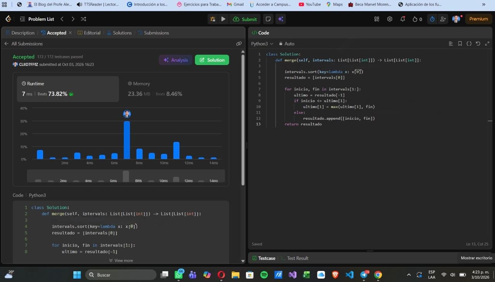
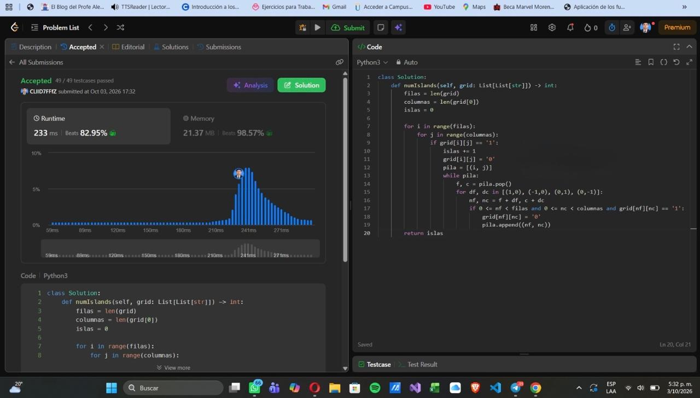
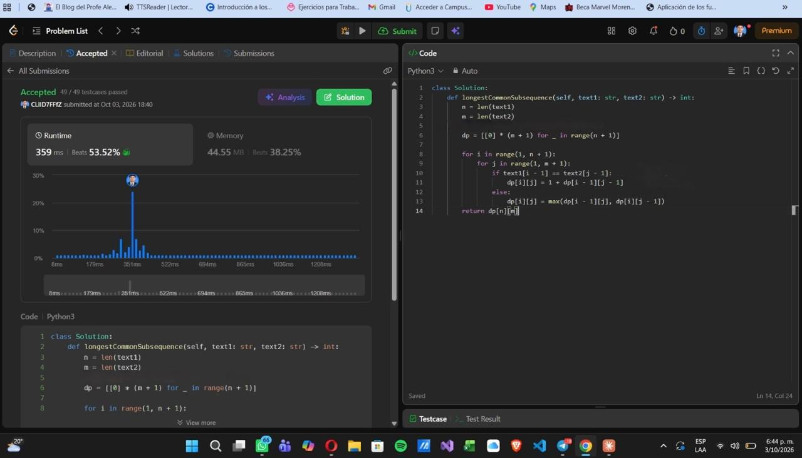
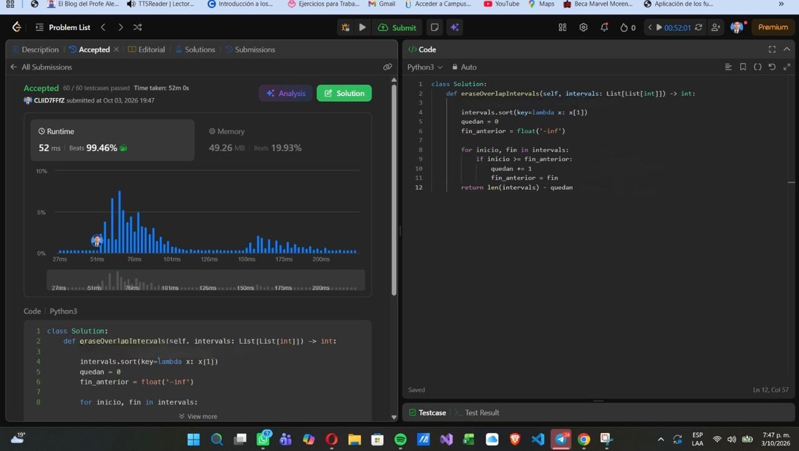
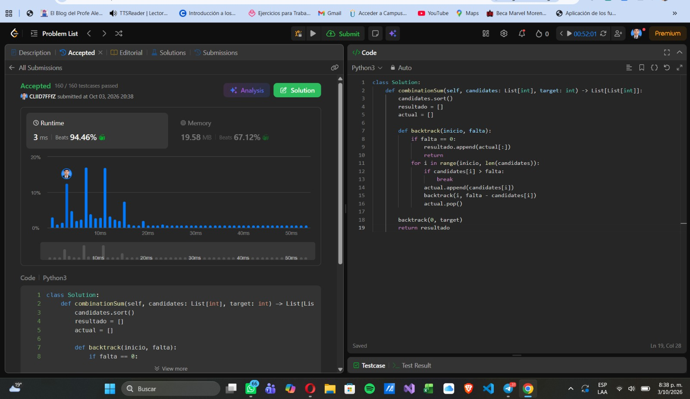

# Taller · Cinco familias en LeetCode

| # | Problema | Familia | Código | Evidencia |
| --- | --- | --- | --- | --- |
| 1 | [56. Merge Intervals](https://leetcode.com/problems/merge-intervals/) | Ordenamiento | [merge-intervals/solution.py](./merge-intervals/solution.py) | [merge-intervals-accepted.png](./evidencias/merge-intervals-accepted.png) |
| 2 | [200. Number of Islands](https://leetcode.com/problems/number-of-islands/) | Grafos | [number-of-islands/solution.py](./number-of-islands/solution.py) | [number-of-islands-accepted.png](./evidencias/number-of-islands-accepted.png) |
| 3 | [1143. Longest Common Subsequence](https://leetcode.com/problems/longest-common-subsequence/) | Programación dinámica | [longest-common-subsequence/solution.py](./longest-common-subsequence/solution.py) | [longest-common-subsequence-accepted.png](./evidencias/longest-common-subsequence-accepted.png) |
| 4 | [435. Non-overlapping Intervals](https://leetcode.com/problems/non-overlapping-intervals/) | Greedy | [non-overlapping-intervals/solution.py](./non-overlapping-intervals/solution.py) | [non-overlapping-intervals-accepted.png](./evidencias/non-overlapping-intervals-accepted.png) |
| 5 | [39. Combination Sum](https://leetcode.com/problems/combination-sum/) | Backtracking | [combination-sum/solution.py](./combination-sum/solution.py) | [combination-sum-accepted.png](./evidencias/combination-sum-accepted.png) |

---

## 1. 56. Merge Intervals

**Problema:** [56. Merge Intervals](https://leetcode.com/problems/merge-intervals/)  
**Familia:** Ordenamiento  
**Código:** [merge-intervals/solution.py](./merge-intervals/solution.py)

**Idea:**  
Primero ordeno los intervalos usando su valor inicial. Esto hace que los intervalos que podrían cruzarse queden uno cerca del otro. Después los recorro y comparo cada intervalo con el último que ya guardé. Si el nuevo empieza antes de que termine el anterior, o justo en el mismo punto, los uno tomando el final más grande. Si no se cruzan, simplemente agrego el intervalo como uno nuevo.

**Complejidad:**  
- **Tiempo: O(n log n)**, donde `n` es la cantidad de intervalos. Lo que más cuesta es ordenarlos; después solo se recorren una vez.
- **Espacio: O(n)**, porque en el peor caso todos los intervalos quedan separados y deben guardarse en el resultado.

**Evidencia:** [evidencias/merge-intervals-accepted.png](./evidencias/merge-intervals-accepted.png)

---

## 2. 200. Number of Islands

**Problema:** [200. Number of Islands](https://leetcode.com/problems/number-of-islands/)  
**Familia:** Grafos  
**Código:** [number-of-islands/solution.py](./number-of-islands/solution.py)

**Idea:**  
En este problema tomo cada celda con `'1'` como una parte de tierra que puede estar conectada con otras celdas de arriba, abajo, izquierda o derecha. Cada vez que encuentro un `'1'` que todavía no había visitado, significa que encontré una nueva isla, entonces aumento el contador. Desde esa celda hago un DFS usando una pila para recorrer toda la isla y voy cambiando las celdas visitadas a `'0'`, así no vuelvo a contar la misma isla después.

**Complejidad:**  
- **Tiempo: O(m · n)**, donde `m` es el número de filas y `n` el número de columnas, ya que cada celda se revisa como máximo una vez.
- **Espacio: O(m · n)** en el peor caso, porque si toda la matriz fuera tierra, la pila del DFS podría llegar a guardar muchas celdas.

**Evidencia:** [evidencias/number-of-islands-accepted.png](./evidencias/number-of-islands-accepted.png)

---

## 3. 1143. Longest Common Subsequence

**Problema:** [1143. Longest Common Subsequence](https://leetcode.com/problems/longest-common-subsequence/)  
**Familia:** Programación dinámica  
**Código:** [longest-common-subsequence/solution.py](./longest-common-subsequence/solution.py)

**Idea:**  
Para resolverlo uso una tabla `dp` en la que voy guardando resultados de partes más pequeñas del problema. En `dp[i][j]` guardo la longitud de la subsecuencia común más larga que se puede formar usando los primeros `i` caracteres de `text1` y los primeros `j` caracteres de `text2`.

Si los dos caracteres que estoy comparando son iguales, puedo agregarlos a la subsecuencia y sumo 1 al resultado que ya tenía antes. Si son diferentes, pruebo las dos posibilidades: ignorar un carácter de `text1` o ignorar uno de `text2`, y me quedo con el resultado más grande.

**Estado:**  
`dp[i][j]` representa la longitud de la subsecuencia común más larga entre `text1[0..i)` y `text2[0..j)`.

**Caso base:**  
Si una de las dos cadenas está vacía, no puede haber una subsecuencia común, por eso:

`dp[0][j] = 0`  
`dp[i][0] = 0`

**Recurrencia:**  
- Si `text1[i-1] == text2[j-1]`:

  `dp[i][j] = 1 + dp[i-1][j-1]`

- Si los caracteres son diferentes:

  `dp[i][j] = max(dp[i-1][j], dp[i][j-1])`

**Complejidad:**  
- **Tiempo: O(n · m)**, donde `n` y `m` son las longitudes de `text1` y `text2`, porque se llena una tabla de `n × m`.
- **Espacio: O(n · m)** por la tabla `dp` que guarda los resultados.

**Evidencia:** [evidencias/longest-common-subsequence-accepted.png](./evidencias/longest-common-subsequence-accepted.png)

---

## 4. 435. Non-overlapping Intervals

**Problema:** [435. Non-overlapping Intervals](https://leetcode.com/problems/non-overlapping-intervals/)  
**Familia:** Greedy  
**Código:** [non-overlapping-intervals/solution.py](./non-overlapping-intervals/solution.py)

**Idea:**  
Primero ordeno los intervalos por el punto donde terminan. Después los recorro y voy conservando los que no se cruzan con el último intervalo que acepté. El criterio greedy es quedarme siempre con el intervalo que termina primero, porque eso deja la mayor cantidad de espacio posible para poder aceptar más intervalos después.

En lugar de contar directamente cuáles debo borrar, cuento cuántos intervalos puedo conservar sin que se crucen. Al final resto esa cantidad al número total de intervalos y así obtengo cuántos hay que eliminar.

**Complejidad:**  
- **Tiempo: O(n log n)**, donde `n` es la cantidad de intervalos. El ordenamiento es la parte que más tiempo toma y luego se hace un solo recorrido.
- **Espacio: O(1)** adicional para realizar el recorrido, sin contar el espacio interno que pueda utilizar el método de ordenamiento.

**Evidencia:** [evidencias/non-overlapping-intervals-accepted.png](./evidencias/non-overlapping-intervals-accepted.png)

---

## 5. 39. Combination Sum

**Problema:** [39. Combination Sum](https://leetcode.com/problems/combination-sum/)  
**Familia:** Backtracking  
**Código:** [combination-sum/solution.py](./combination-sum/solution.py)

**Idea:**  
En este problema voy construyendo una combinación poco a poco. Elijo uno de los candidatos, lo agrego a la combinación actual y continúo buscando con lo que todavía falta para llegar al `target`.

Como cada número se puede usar varias veces, después de elegir un candidato puedo volver a utilizar el mismo índice. También evito regresar a índices anteriores para no generar las mismas combinaciones en distinto orden.

La parte de backtracking ocurre cuando termino de probar una opción: hago `pop()` para quitar el último número que agregué y así puedo intentar otra posibilidad. Si lo que falta llega a `0`, encontré una combinación válida. Además, como los candidatos están ordenados, si uno ya es mayor que lo que falta, corto esa rama porque los siguientes también serán demasiado grandes.

**Complejidad:**  
Si `n` es la cantidad de candidatos, `t` es el `target` y `c` es el candidato más pequeño:

- **Tiempo: O(n^(t/c))** en el peor caso, porque se pueden generar muchas ramas diferentes y la profundidad depende de cuántas veces se pueda usar el candidato más pequeño.
- **Espacio: O(t/c)** por la profundidad máxima de la recursión y la combinación actual, sin contar las combinaciones que se guardan en la respuesta.

**Evidencia:** [evidencias/combination-sum-accepted.png](./evidencias/combination-sum-accepted.png)

