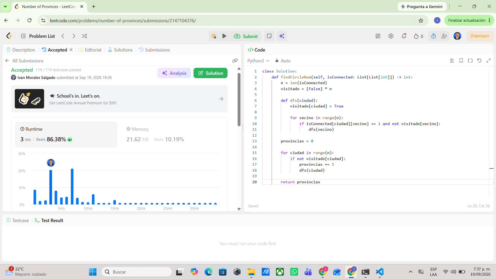

# Tarea 3 Grafos

## 547 Number of Provinces

Problema  
https://leetcode.com/problems/number-of-provinces/

Modelo  
En este problema cada ciudad es un vertice y cada conexion entre dos ciudades es una arista como la conexion funciona en ambos sentidos el grafo es no dirigido y lo que se busca es contar cuantas componentes conexas hay

Algoritmo  
Use DFS porque cada vez que encuentro una ciudad que todavia no ha sido visitada cuento una provincia nueva y desde esa ciudad recorro todas las demas ciudades que pertenecen al mismo grupo marcandolas como visitadas

Complejidad  
n es el numero de ciudades y m es el numero de conexiones como la entrada viene en una matriz de n por n se deben revisar las posiciones de la matriz por eso el tiempo es O(n²) y el espacio extra es O(n) por el arreglo de visitados y la pila usada por DFS

Evidencia  

## 207 Course Schedule

Problema  
https://leetcode.com/problems/course-schedule/

Modelo  
En este problema cada curso es un vertice y cada prerrequisito es una arista dirigida si aparece un par curso requisito la direccion va desde el requisito hacia el curso porque primero se debe completar el requisito antes de poder tomar el curso

Algoritmo  
Use el algoritmo de Kahn con orden topologico primero se buscan los cursos que no tienen prerrequisitos y se van procesando mientras se eliminan sus dependencias si al final se logran procesar todos los cursos quiere decir que no existe un ciclo y se pueden terminar todos pero si quedan cursos sin procesar significa que existe un ciclo

Complejidad  
n es el numero de cursos y m es el numero de prerrequisitos el tiempo es O(n + m) porque se recorren los cursos y las relaciones entre ellos y el espacio es O(n + m) porque se guarda la lista de adyacencia el grado de entrada de cada curso y la cola usada por Kahn

Evidencia  

