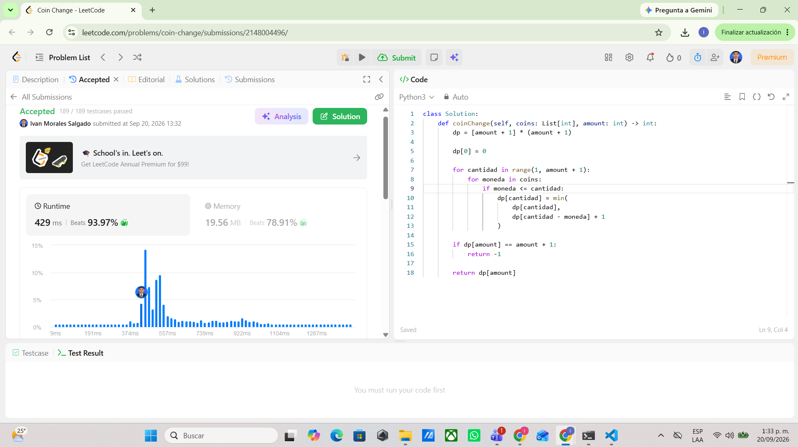
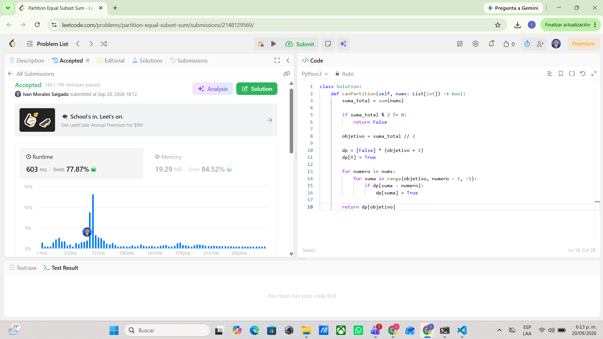

# Tarea 4 Programacion Dinamica

## 322 Coin Change

Problema  
https://leetcode.com/problems/coin-change/

Estado  
dp[x] guarda la menor cantidad de monedas necesarias para formar la cantidad x

Recurrencia  
Para cada cantidad se prueban todas las monedas y si la moneda puede usarse se compara la respuesta actual con dp[cantidad - moneda] + 1 y se guarda la opcion que use menos monedas

dp[x] = min(dp[x] dp[x - moneda] + 1)

Casos base  
dp[0] = 0 porque para formar una cantidad de cero no se necesita ninguna moneda las demas posiciones empiezan con amount + 1 para representar que todavia no se ha encontrado una forma de llegar a esa cantidad y si dp[amount] conserva ese valor al final se retorna -1

Reutilizacion  
Las monedas se pueden usar todas las veces que sea necesario por eso es un problema no acotado se recorren las cantidades desde 1 hasta amount de forma ascendente y para cada cantidad se prueban todas las monedas de esta forma los resultados de cantidades menores ya pueden volver a utilizarse

Complejidad  
k es la cantidad de tipos de monedas y amount es la cantidad que se quiere formar el tiempo es O(amount * k) porque para cada cantidad se prueban las k monedas y el espacio es O(amount) por el arreglo dp

Evidencia  

## 416 Partition Equal Subset Sum

Problema  
https://leetcode.com/problems/partition-equal-subset-sum/

Estado  
dp[x] indica si es posible formar la suma x usando los numeros que ya se han revisado

Recurrencia  
Primero se calcula la mitad de la suma total y para cada numero se revisa si una suma puede formarse a partir de una suma anterior si dp[suma - numero] es verdadero entonces dp[suma] tambien pasa a ser verdadero

dp[suma] = dp[suma] or dp[suma - numero]

Casos base  
dp[0] = True porque siempre es posible formar una suma de cero sin escoger ningun numero si la suma total del arreglo es impar se retorna False directamente porque no se puede dividir en dos partes con la misma suma

Reutilizacion  
Cada numero del arreglo se puede usar como maximo una vez por eso es un problema 0/1 para evitar usar el mismo numero varias veces el for de las sumas se recorre de derecha a izquierda desde el objetivo hasta el valor del numero actual

Complejidad  
n es la cantidad de numeros del arreglo y W es la mitad de la suma total que es la suma que se intenta formar el tiempo es O(n * W) porque por cada numero se recorren las posibles sumas hasta W y el espacio es O(W) por el arreglo dp

Evidencia  

